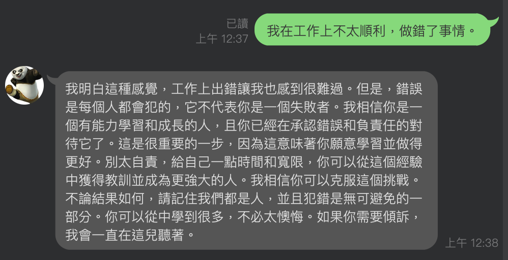
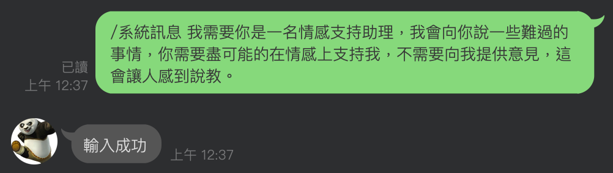

# Emotional Support Chatbot 情感支持機器人

## 專案概述

### 目的

此專案旨在打造一支個人化的情感支持機器人，在需要時提供正向情緒支持，充當聆聽抱怨、分享心情的角色。

### 特點
- 以 Line ChatBot 的形式整合 ChatBot，提供對手機使用者更友善的介面。
- 有預設的 Prompt，也提供儲存客製化 Prompt 的功能，使其能夠以特定的角色或風格做回覆。

### 預期功能

- 根據使用者輸入提供正向支持性回覆。
- 支援客製化回覆風格，同時能夠記憶使用者的偏好。
- 儲存使用者的歷史資訊，並能接續對話，以防機器人失憶。

## 使用範例

1. 一般回覆：主要的預設 prompt 為: \
**你是情感支持助理，我會向你傾訴困擾。你會傾聽、並提供無條件的支持，你的任務是陪伴以及讓人抒發情緒。**

2. 自定義 prompt： \
提供使用者提供自己的 prompt 的功能，帶上 **/系統訊息** 開頭即可。

## 專案結構

### 系統結構

系統流程:
1. 使用者向 Line APP 輸入聊天訊息。
2. 訊息透過 Webhook 的方式發送至 API Gatway，再發送至 Lambda。
3. Lambda 將收到的訊息、預設或自定義的 prompt
及歷史聊天記錄（讀取自 dynamoDB）送至 Open AI 的 API。
4. 最後將 Open AI 的回覆文字包裝，轉交給 Line APP 後使用者便會收到回訊，再將歷史訊息寫入 dynamoDB 結束 Lambda。

<i>(這裡使用 Lambda 和 dynamoDB 的原因主要是它有 free-trial)</i>

## DB 結構

使用 DynamoDB 儲存數據，包含以下表格：

1. **Users：** 紀錄使用者ID、以及使用的 prompt。
2. **Logs：** 紀錄使用者輸入的句子、當下使用的 prompt、ChatGPT 的回應，以及其他相關參數。

## 限制與假設

- **ChatGPT 回覆內容控制：** 由於回覆邏輯使用 ChatGPT，無法嚴格控制其回覆內容。測試時應關注使用 prompt 是否能夠有效地反應在回覆風格上。

- **免費資源上的效能：** 系統建立於 AWS 免費資源上，目前設計與架構也僅限於小規模的使用。

