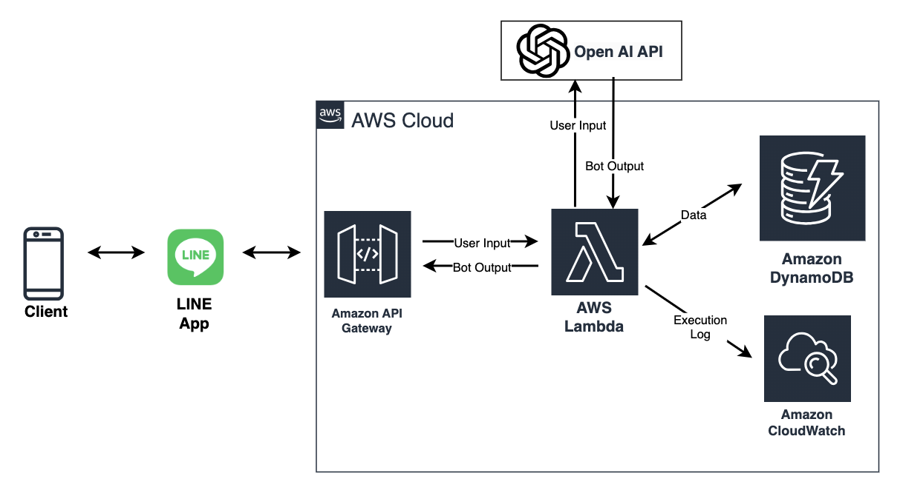
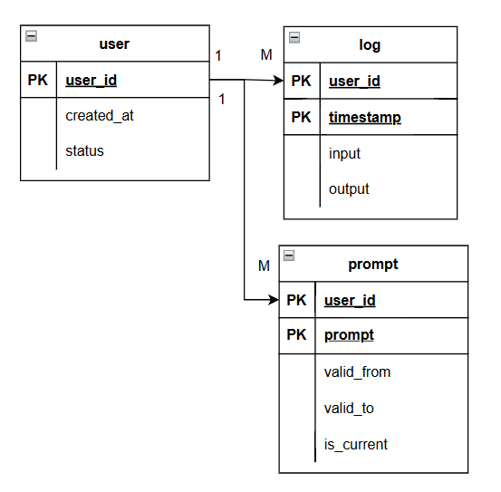

# Emotional Support Chatbot 情感支持機器人

## 專案概述

### 目的

此專案旨在打造一支個人化情感支持機器人，能夠在需要時提供正向情緒支持，充當聆聽抱怨、分享心情的角色。我們期望透過這支機器人，為使用者提供無條件的正向支持。
(未來也不排除設定多個角色切換)

### 預期功能

- 根據使用者輸入提供正向支持性回覆。
- 支援客製化回覆風格，同時能夠記憶使用者的偏好。
- 儲存使用者的歷史資訊，並能接續對話，以防機器人失憶。

## 專案結構

### 系統結構

主要透過 ChatGPT API 處理回應邏輯，運算資源建構於 AWS Lambda 上，API Gateway 用於接受請求，而 DynamoDB 用於紀錄使用者需求及相關 Log。
(這裡使用 Lambda 和 dynamoDB 的原因主要是它有 free-trial)

## 數據需求

使用 DynamoDB 儲存數據，包含以下三張表：

1. **Users：** 紀錄使用者ID、以及使用的 prompt。
2. **Logs：** 紀錄使用者輸入的句子、當下使用的 prompt、ChatGPT 的回應，以及其他相關參數。

## 限制與假設

- **ChatGPT 回覆內容控制：** 由於回覆邏輯使用 ChatGPT 實作，無法嚴格控制其回覆內容。測試時應關注使用 prompt 是否能夠有效地影響回覆風格。

- **免費資源上的效能：** 限制與假設中提到系統建立於 AWS 免費資源上，因此不進行效能檢測。

